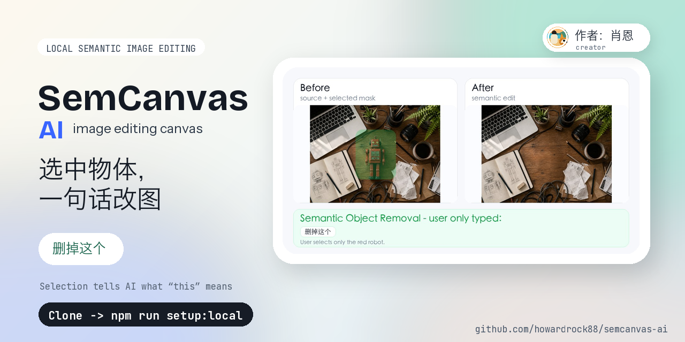
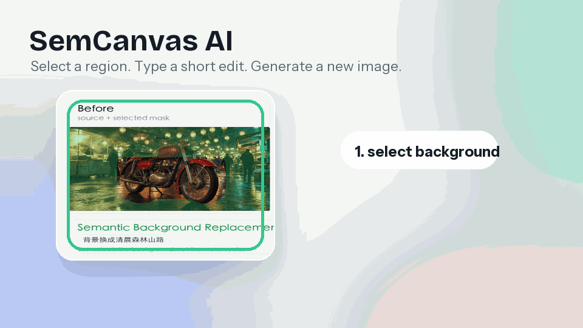
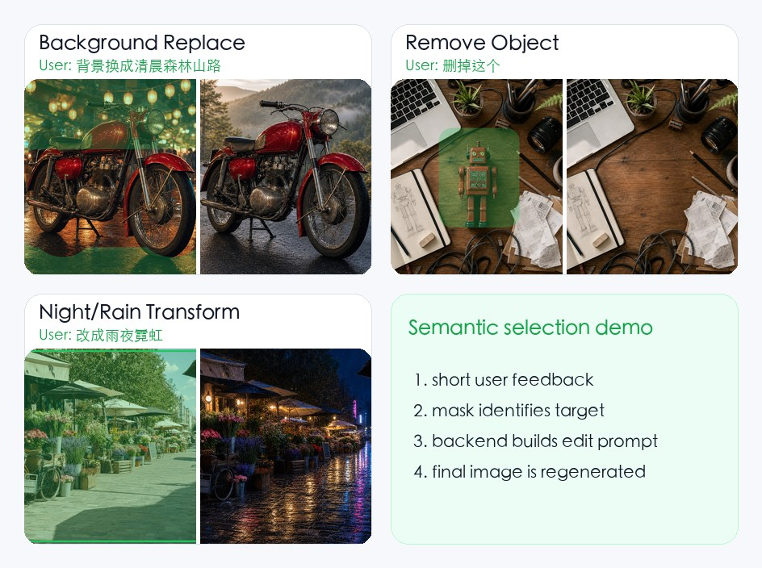
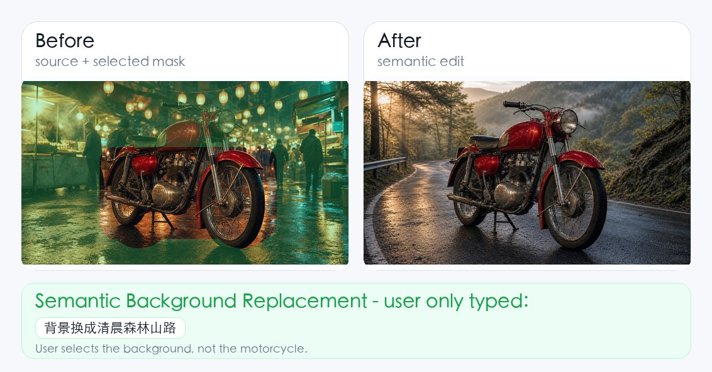
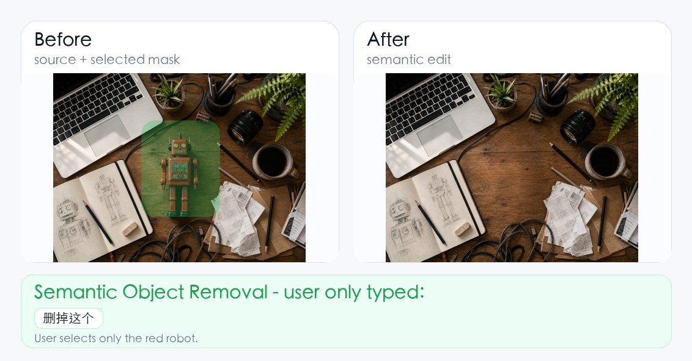
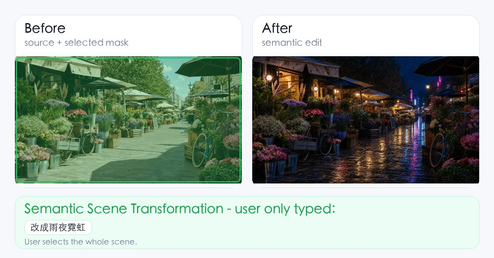
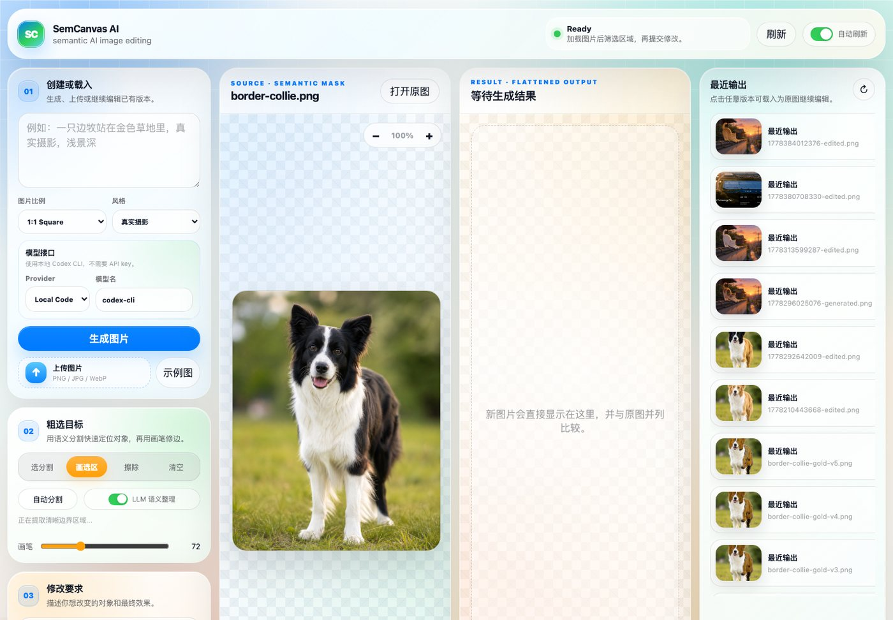

# SemCanvas AI

English | [简体中文](./README.md) | [Changelog](./CHANGELOG.md)



Select a region, type a short edit, and generate a new complete image. The default provider is the local Codex CLI, with optional OpenAI Images API, nano-banana-style APIs, ComfyUI wrappers, or your own image gateway.

```bash
git clone https://github.com/howardrock88/semcanvas-ai.git
cd semcanvas-ai
npm run setup:local
npm start
```



Semantic AI image editing canvas. Generate an image, segment it into editable regions, select a subject or rough brush area, describe the change in natural language, and send the edit to a pluggable image model provider.

This repository is a local-first demo/prototype. It is designed to be easy to fork and adapt for GPT Image, nano-banana-style services, ComfyUI wrappers, or your own image generation gateway.

## Features

- Prompt-to-image generation with aspect ratio and style presets.
- Local image upload and side-by-side original/result comparison.
- Automatic segmentation with `FastSAM`, full `SAM`, or a lightweight fallback.
- Extra title/text region detection; logo text is kept with the graphic mark as one `品牌标识` region when possible.
- Optional LLM semantic cleanup for segmentation candidates.
- Click-to-select segment chips, brush selection, erase, clear, and canvas zoom.
- Semantic local editing: the mask is treated as a rough object pointer, not as a pasted overlay.
- Pluggable image providers:
  - `codex`: local Codex CLI provider for local prototyping.
  - `openai`: OpenAI Images API provider.
  - `custom`: generic HTTP provider for nano-banana, ComfyUI wrappers, or your own service.

## Examples

These are real local demo outputs from the current prototype, not external product mockups.

### What Semantic Selection Should Prove

The important UX is not “write a perfect image prompt.” The intended workflow is:

```text
select a region -> type a short user instruction -> backend expands it with image context, mask, and guardrails
```

For a fair semantic-editing demo, the user-facing instruction should be short. The selection identifies *what* to edit, and the text describes *how* to change it.

| Selected region | User typed | What the backend should infer |
| --- | --- | --- |
| Background around the motorcycle | `背景换成清晨森林山路` | Replace only the selected background, keep the motorcycle stable. |
| Red robot on the desk | `删掉这个` | Remove the selected object and reconstruct the desk underneath. |
| Whole flower market scene | `改成雨夜霓虹` | Preserve layout while changing time, weather, light, and reflections. |
| Cat subject | `换成橘猫` | Edit the selected cat, preserve pose and background. |

### Short Instruction Semantic Examples

These examples were regenerated with short user feedback only. The green overlay on the `Before` image shows the selected mask.



#### Semantic Background Replacement

User typed:

```text
背景换成清晨森林山路
```



#### Semantic Object Removal

User typed:

```text
删掉这个
```



#### Semantic Scene Transformation

User typed:

```text
改成雨夜霓虹
```




### App UI




## Quick Start: Default Local Codex CLI

```bash
git clone https://github.com/howardrock88/semcanvas-ai.git
cd semcanvas-ai
npm run setup:local
npm start
```

Open:

```text
http://127.0.0.1:4321
```

The default configuration calls the user's local Codex CLI. The project does not ship an API key. Each user must install and log in to Codex locally:

```bash
codex --version
codex
```

If you prefer manual setup:

```bash
npm install
cp .env.example .env
npm run setup:fastsam
npm start
```

`npm run setup:fastsam` creates the local Python virtualenv, installs FastSAM dependencies, and downloads the model weights. Users do not need to search for model download links.

## macOS Background Service

To run the app like the local demo, with automatic restart in the background:

```bash
npm run service:install
```

Useful commands:

```bash
npm run service:status
npm run service:restart
npm run service:stop
npm run service:logs
npm run service:uninstall
```

The service script generates a `launchd` plist for the current project path. The default label is `ai.semcanvas.local`. The service reads `.env` from the project root, so run `npm run service:restart` after changing API configuration.

## Provider Configuration

You can configure providers from the UI, `.env`, or system environment variables. System environment variables override `.env`.

### 1. Local Codex CLI

`.env.example` defaults to this provider:

```bash
IMAGE_PROVIDER=codex
CODEX_TIMEOUT_MS=720000
```

Requirements:

- Local `codex` CLI is installed and authenticated.
- Your local Codex setup can generate/edit images.
- Complex image edits can take several minutes. Use `CODEX_TIMEOUT_MS` if you need a longer local timeout.

This provider is useful for proof-of-concept work. It is not a stable production image API.

### 2. OpenAI Images API

Edit `.env`:

```bash
OPENAI_API_KEY=sk-...
IMAGE_PROVIDER=openai
OPENAI_IMAGE_MODEL=gpt-image-1.5
OPENAI_IMAGES_BASE_URL=https://api.openai.com/v1
```

Then restart the server:

```bash
npm start
# or
npm run service:restart
```

In the UI, you can also select `OpenAI GPT Image` and temporarily fill in the API key. You may leave the API key field empty if `OPENAI_API_KEY` is set on the server.

Notes:

- Generation calls `POST /v1/images/generations`.
- Editing calls `POST /v1/images/edits` with an image and alpha mask.
- The app normalizes output dimensions after generation/editing, so the comparison canvas stays stable.
- Check the current OpenAI image model names and parameters in the official docs before production use: https://platform.openai.com/docs/guides/image-generation

### 3. Custom HTTP Provider

Use this for nano-banana-style APIs, ComfyUI wrappers, Replicate-style gateways, or a small adapter you write yourself.

Edit `.env`:

```bash
IMAGE_PROVIDER=custom
IMAGE_API_ENDPOINT=http://127.0.0.1:8787/image
IMAGE_API_KEY=optional-token
IMAGE_MODEL=nanobanana2
```

Then restart the server. In the UI, you can also select `Custom HTTP` and temporarily fill endpoint/model/key as needed.

The app sends JSON.

Generate request:

```json
{
  "task": "generate",
  "model": "nanobanana2",
  "prompt": "Generate one finished image...",
  "aspectRatio": "1:1",
  "stylePreset": "photo",
  "targetSize": { "width": 1024, "height": 1024 }
}
```

Edit request:

```json
{
  "task": "edit",
  "model": "nanobanana2",
  "prompt": "Create a new, flattened image...",
  "targetSize": { "width": 1024, "height": 1024 },
  "image": "data:image/png;base64,...",
  "mask": "data:image/png;base64,...",
  "overlay": "data:image/png;base64,..."
}
```

Supported response shapes:

```json
{ "imageDataUrl": "data:image/png;base64,..." }
```

```json
{ "imageBase64": "..." }
```

```json
{ "url": "https://example.com/result.png" }
```

```json
{ "path": "/absolute/local/result.png" }
```

## Segmentation Setup

The app auto-selects segmentation backends in this order:

```text
SAM checkpoint > FastSAM > lightweight fallback
```

FastSAM is recommended for this demo because it is small and practical locally:

```bash
npm run setup:fastsam
npm start
```

Full SAM:

```bash
npm run setup:sam
npm start
```

Force a backend:

```bash
SEGMENT_BACKEND=fastsam npm start
SEGMENT_BACKEND=sam npm start
SEGMENT_BACKEND=fallback npm start
```

Related environment variables:

- `SAM_PYTHON`: segmentation virtualenv Python, default `.venv-seg/bin/python`
- `SAM_CHECKPOINT`: SAM checkpoint path, default `models/sam_vit_b_01ec64.pth`
- `SAM_DEVICE`: default `cpu`
- `SAM_MAX_DIM`: default `768`
- `FASTSAM_MODEL`: default `models/FastSAM-s.pt`
- `FASTSAM_DEVICE`: default follows `SAM_DEVICE`
- `FASTSAM_MAX_DIM`: default `768`

## Usage Flow

1. Generate or upload an image.
2. Click **自动分割**. Keep **LLM 语义整理** enabled if you want semantic cleanup.
3. Choose **选分割** and click a segment, or use **画选区** / **擦除**.
4. Type a natural-language edit instruction.
5. Click **生成修改结果**.
6. Download the result or set it as the new source image for another edit pass.

Example short edit instructions:

- `change to a golden Border Collie`
- `make the sky sunset`
- `make it matte black`
- `remove the wall graffiti`

## Project Structure

```text
public/                 Frontend UI
docs/images/            README screenshots and real before/after examples
server.mjs              Local HTTP server and provider orchestration
tools/                  Python helpers plus local setup and macOS service scripts
storage/uploads/        Local uploaded/source images, gitignored except .gitkeep
storage/outputs/        Generated results, gitignored except .gitkeep
storage/tmp/            Temporary masks/contact sheets, gitignored except .gitkeep
models/                 Local segmentation model weights, gitignored except .gitkeep
```

## Development

```bash
npm run check
npm start
```

The server intentionally uses `cache-control: no-store` for local frontend iteration.

## Security Notes

- This is a local demo. Do not expose it directly to the public internet.
- API keys entered in the UI are stored in browser `localStorage` for convenience. For shared machines, prefer environment variables.
- Generated images, uploads, masks, and temporary files stay on disk under `storage/`.
- Model weights are ignored by git. Download them locally with the setup scripts.

## GitHub Release Checklist

Before pushing:

```bash
npm run check
rm -rf storage/tmp/* storage/outputs/*
find storage/uploads -type f ! -name '.gitkeep' -delete
```

Keep sample images only if you have rights to publish them. Large model files should not be committed.

## Limitations

- The lightweight fallback segmentation is only for interaction testing. Use FastSAM or SAM for real object masks.
- LLM semantic cleanup currently uses the local Codex CLI path. If you want semantic cleanup through another model, adapt `enhanceSegmentsWithCodex` in `server.mjs`.
- Different image providers use different mask semantics. The OpenAI provider converts the UI's white-selected mask into an alpha mask before calling the Images API.
- Custom provider behavior depends on your adapter returning a supported image field.

## License

MIT. See [LICENSE](./LICENSE).
