# SemCanvas AI

[English](./README.md) | 简体中文

SemCanvas AI 是一个语义化 AI 图片编辑画布。你可以先生成或上传一张图片，系统把图片分割成可点击的区域；用户选择主体、物体或用画笔粗略圈选后，用自然语言描述修改意见，后台会把原图、选区和修改要求组合成新的生成/编辑 prompt，再调用可插拔的图片模型生成一张新的完整图片。

这个仓库是一个本地优先的 demo/prototype，目标是方便你 fork 后改造成 GPT Image、nano-banana 类服务、ComfyUI 包装器，或者你自己的图片生成网关。

## 功能

- 支持 prompt 生成图片，可选择图片比例和风格预设。
- 支持本地上传图片，并排展示原图和修改结果。
- 自动分割图片区域，支持 `FastSAM`、完整 `SAM` 或轻量 fallback。
- 可选 LLM 语义整理分割结果，让候选区域更接近“主体/背景/物体”这类可编辑对象。
- 支持点击分割区域、画笔圈选、擦除、清空选区和画布缩放。
- 语义化局部编辑：选区只作为“你想改哪里”的粗略指针，不会把半透明图层直接盖到原图上。
- 可插拔图片模型接口：
  - `codex`：调用本地 Codex CLI，适合本地原型验证。
  - `openai`：调用 OpenAI Images API。
  - `custom`：通用 HTTP 接口，适合 nano-banana、ComfyUI wrapper 或自建服务。

## 示例

下面都是真实本地 demo 输出，不是外部产品 mockup。

### Semantic Selection 应该证明什么

这个工具真正要证明的不是“用户会写完美图片 prompt”。理想交互应该是：

```text
选中区域 -> 输入一句很短的修改意见 -> 后台结合原图、mask 和约束自动扩写 prompt
```

公平的 semantic editing demo 里，用户侧指令应该很短。选区负责说明“改哪里”，文字只负责说明“怎么改”。

| 选中的区域 | 用户输入 | 后台应该推断 |
| --- | --- | --- |
| 摩托车以外的背景 | `背景换成清晨森林山路` | 只替换选中的背景，保留摩托车主体。 |
| 桌面上的红色机器人 | `删掉这个` | 移除选中的物体，并自然补全下面的桌面。 |
| 整张花市街景 | `改成雨夜霓虹` | 保留街道布局，改变时间、天气、灯光和地面反射。 |
| 猫咪主体 | `换成橘猫` | 修改选中的猫，保留姿势和背景。 |

### 短指令语义编辑示例

下面这三组示例已经用短用户反馈重新生成。`Before` 图里的绿色半透明区域表示用户选中的 mask。


#### 短指令背景替换

用户输入：

```text
背景换成清晨森林山路
```


#### 短指令物体移除

用户输入：

```text
删掉这个
```


#### 短指令场景转换

用户输入：

```text
改成雨夜霓虹
```


后面部分示例用了更明确的 stress-test 指令，目的是让 README 输出更稳定、可复现。它们不应该被理解成理想的用户输入。

### 工具界面


### 风格预设示例

下面的示例都来自同一套本地流程：

```text
/api/generate -> 粗略选区或分割 mask -> /api/edit -> docs/images
```

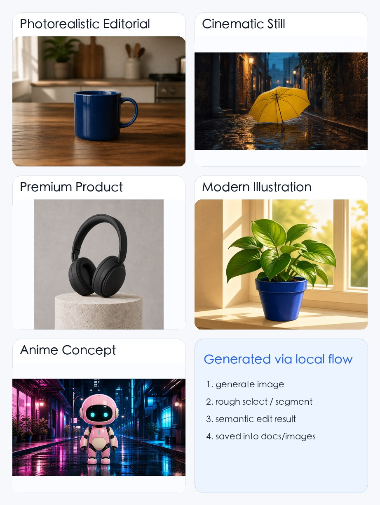

#### 写实摄影风格 (`photo`, `4:3`)

修改指令：

```text
把选中的白色陶瓷杯改成深海蓝色釉面杯，保留桌面、光线、背景和摄影构图
```

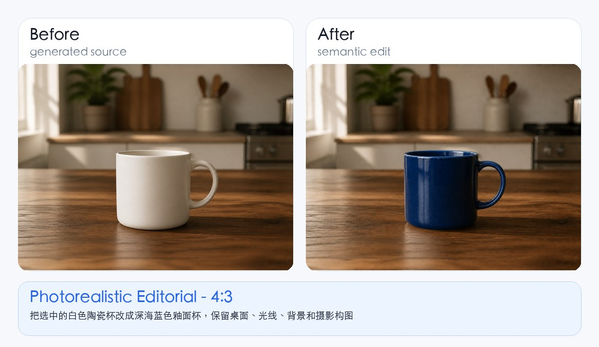

#### 电影剧照风格 (`cinematic`, `16:9`)

修改指令：

```text
把选中的红色雨伞改成明亮的向日葵黄色，保留雨夜巷子、石板路、倒影和电影感光线
```

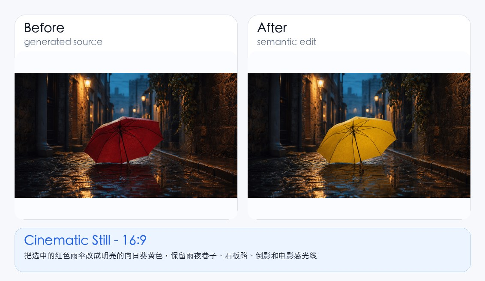

#### 高级产品图风格 (`product`, `1:1`)

修改指令：

```text
把选中的白色头戴式耳机改成磨砂黑和深石墨高光，保留底座、阴影、构图和摄影棚光线
```

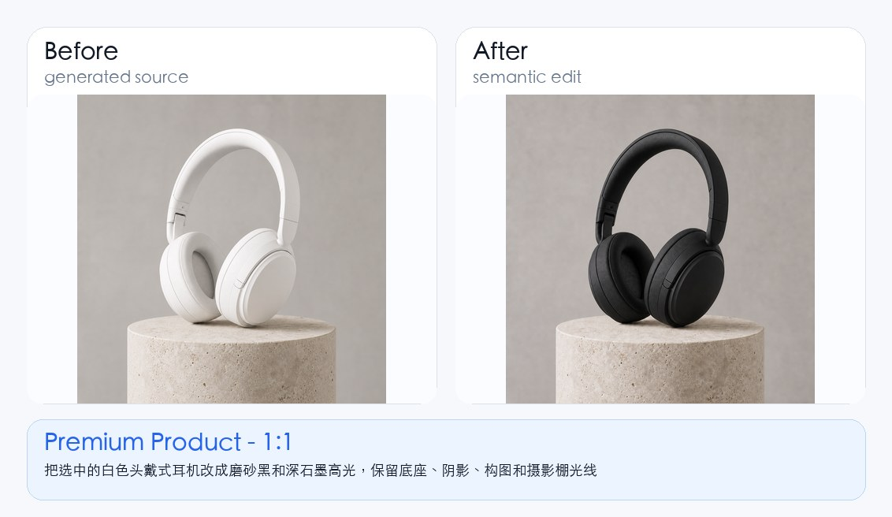

#### 现代插画风格 (`illustration`, `4:3`)

修改指令：

```text
只把选中的陶土花盆改成钴蓝色陶瓷花盆，保留绿叶、窗台、构图和现代插画风格
```

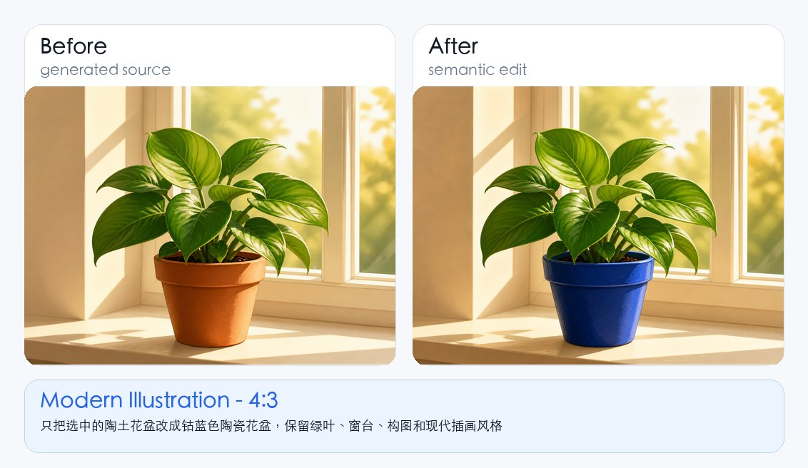

#### 动漫概念图风格 (`anime`, `16:9`)

修改指令：

```text
把选中的白色机器人改成樱花粉和奶油白配色，保留姿势、比例、霓虹街景和动漫概念风格
```

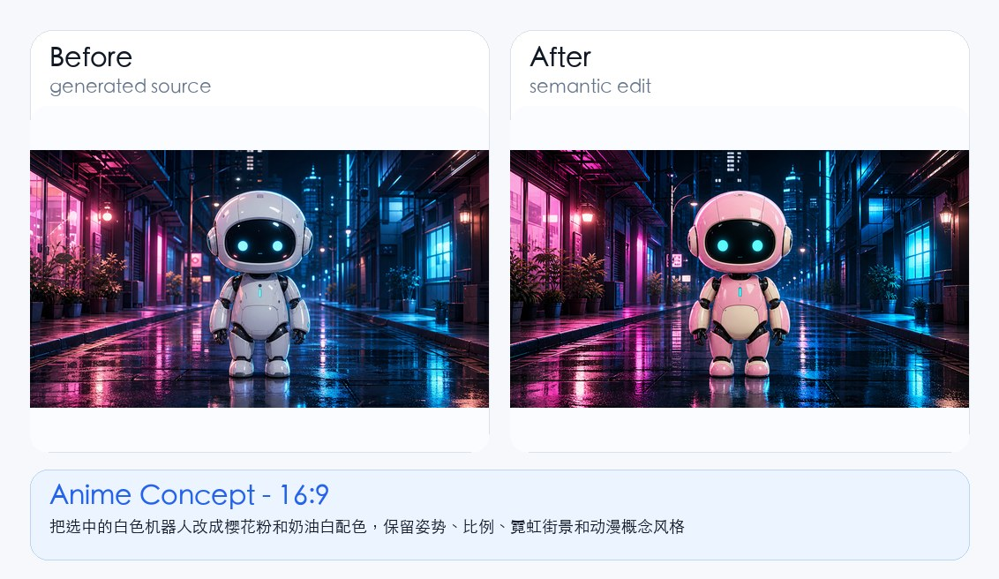

### 进阶编辑示例

下面这些例子比简单的颜色/材质替换更难，主要测试粗略 mask 下的语义编辑能力，包括背景替换、物体移除与补全、全局天气和时间变化。

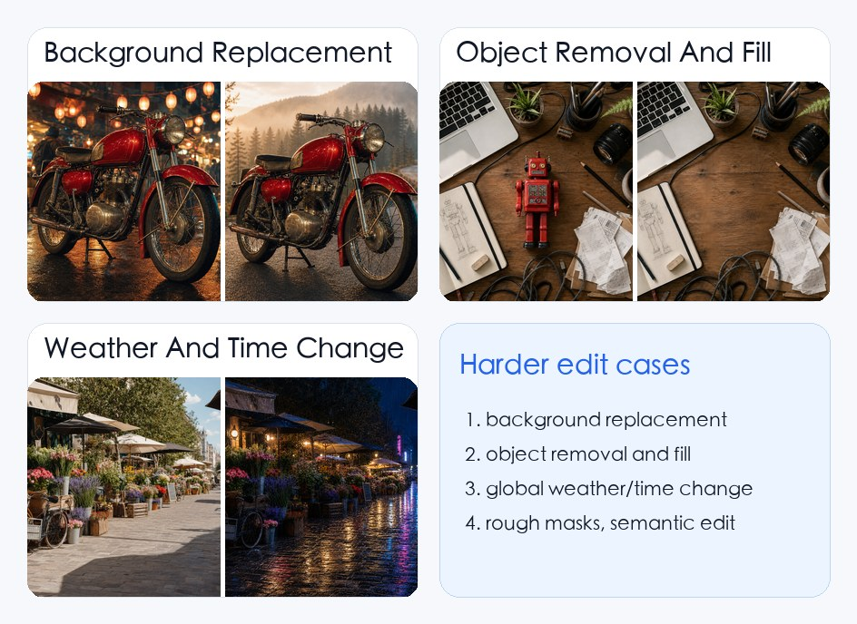

#### 背景替换 (`cinematic`, `16:9`)

修改指令：

```text
把选中的城市夜市背景替换成清晨有薄雾的松林山路，保留红色复古摩托车的位置、比例、透视和光影融合
```

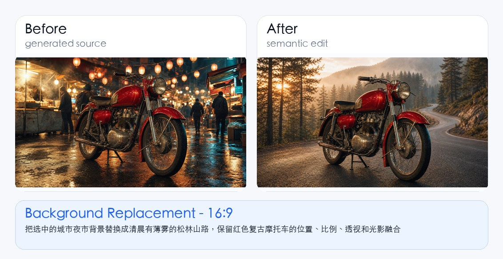

#### 物体移除与补全 (`photo`, `4:3`)

修改指令：

```text
完全移除选中的红色玩具机器人，自然补全下面的木质桌面，保留周围物品、阴影、透视和复杂桌面布局
```

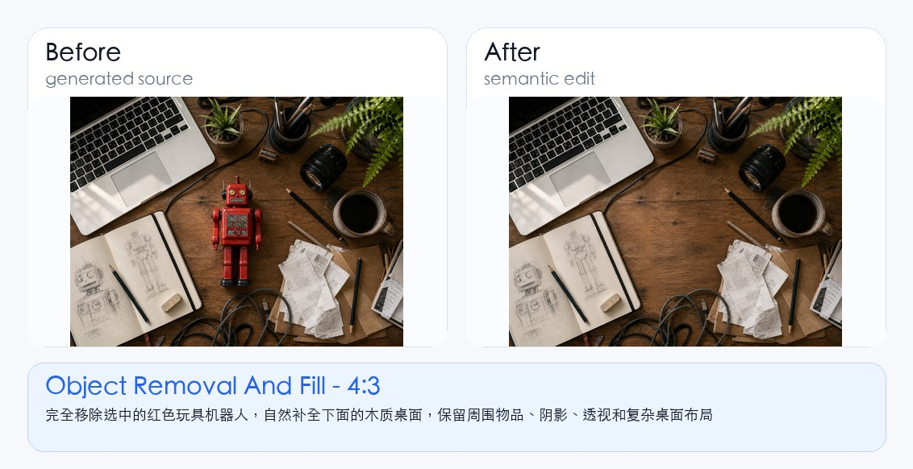

#### 天气与时间变化 (`photo`, `16:9`)

修改指令：

```text
把整张白天花市街景转换成雨夜霓虹版本，保留街道布局、摊位位置、自行车、箱子和整体构图
```

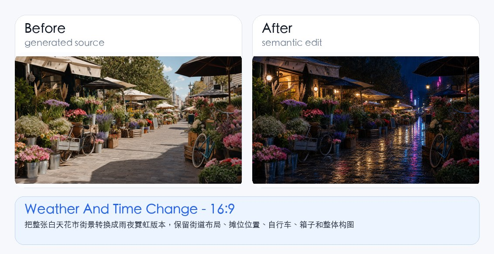

### 区域编辑：边牧毛色

修改指令：

```text
把这只黑白边牧换成金色边牧，毛发自然，保留姿势、背景和光照
```

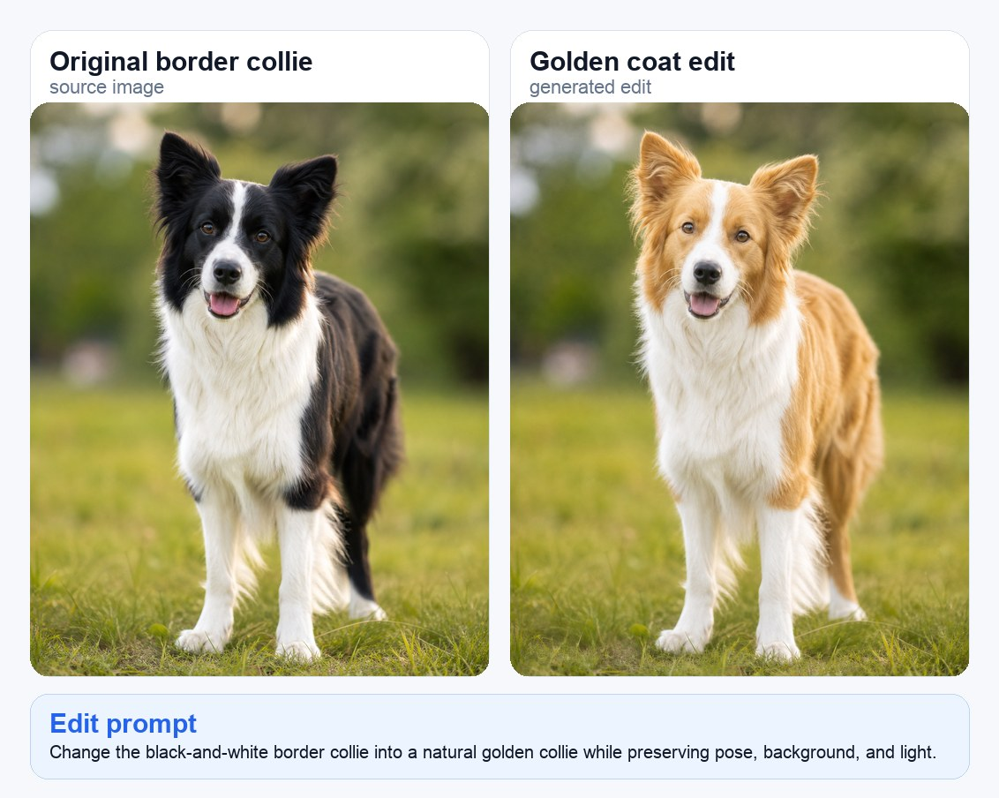

### 区域编辑：猫咪换色且保留背景

修改指令：

```text
把猫咪改成橘色猫，保留姿势、墙面、街道和日落光照
```

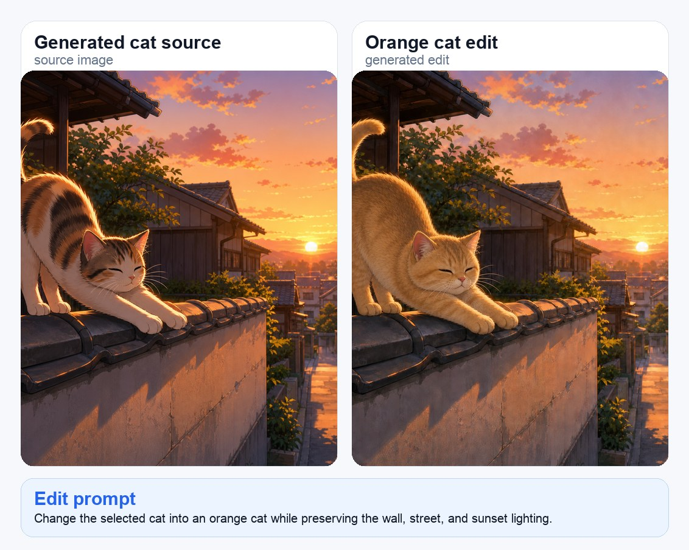

## 快速开始

```bash
npm install
cp .env.example .env
npm start
```

打开：

```text
http://127.0.0.1:4321
```

默认图片模型接口是 `codex`，会调用你本地的 Codex CLI。你也可以在页面里的 **模型接口** 区域切换到 OpenAI 或 Custom HTTP。

## 模型接口配置

模型接口可以通过页面表单配置，也可以通过环境变量配置。

### 1. 本地 Codex CLI

```bash
IMAGE_PROVIDER=codex npm start
```

要求：

- 本机已经安装并登录 `codex` CLI。
- 你的本地 Codex 环境可以生成或编辑图片。
- 复杂图片编辑可能需要几分钟。如果本地调用容易超时，可以调整 `CODEX_TIMEOUT_MS`。

这个接口适合做 proof-of-concept。本质上它依赖本地 Codex CLI 的能力，不建议当成稳定生产 API 使用。

### 2. OpenAI Images API

```bash
OPENAI_API_KEY=sk-...
IMAGE_PROVIDER=openai
OPENAI_IMAGE_MODEL=gpt-image-1.5
OPENAI_IMAGES_BASE_URL=https://api.openai.com/v1
npm start
```

页面里选择 `OpenAI GPT Image`。如果服务端已经设置 `OPENAI_API_KEY`，页面里的 API key 可以留空。

说明：

- 生成图片调用 `POST /v1/images/generations`。
- 编辑图片调用 `POST /v1/images/edits`，会提交原图和 alpha mask。
- 应用会在生成/编辑后归一化输出尺寸，避免左右对比画布大小不一致。
- 生产使用前请以 OpenAI 官方文档为准，确认当前可用的图片模型名称和参数：https://platform.openai.com/docs/guides/image-generation

### 3. Custom HTTP Provider

这个接口适合 nano-banana 类 API、ComfyUI wrapper、Replicate 风格网关，或者你自己写的图片生成服务。

```bash
IMAGE_PROVIDER=custom
IMAGE_API_ENDPOINT=http://127.0.0.1:8787/image
IMAGE_API_KEY=optional-token
IMAGE_MODEL=nanobanana2
npm start
```

页面里选择 `Custom HTTP`，根据需要填写 endpoint、model、key。

应用会发送 JSON 请求。

生成图片请求：

```json
{
  "task": "generate",
  "model": "nanobanana2",
  "prompt": "Generate one finished image...",
  "aspectRatio": "1:1",
  "stylePreset": "photo",
  "targetSize": { "width": 1024, "height": 1024 }
}
```

编辑图片请求：

```json
{
  "task": "edit",
  "model": "nanobanana2",
  "prompt": "Create a new, flattened image...",
  "targetSize": { "width": 1024, "height": 1024 },
  "image": "data:image/png;base64,...",
  "mask": "data:image/png;base64,...",
  "overlay": "data:image/png;base64,..."
}
```

支持的返回格式：

```json
{ "imageDataUrl": "data:image/png;base64,..." }
```

```json
{ "imageBase64": "..." }
```

```json
{ "url": "https://example.com/result.png" }
```

```json
{ "path": "/absolute/local/result.png" }
```

## 分割配置

应用会按以下顺序自动选择分割后端：

```text
SAM checkpoint > FastSAM > lightweight fallback
```

本地 demo 推荐使用 FastSAM，因为模型较小，实际体验更可控：

```bash
./tools/setup_fastsam.sh
npm start
```

完整 SAM：

```bash
./tools/setup_sam.sh
npm start
```

强制指定后端：

```bash
SEGMENT_BACKEND=fastsam npm start
SEGMENT_BACKEND=sam npm start
SEGMENT_BACKEND=fallback npm start
```

相关环境变量：

- `SAM_PYTHON`：分割虚拟环境 Python，默认 `.venv-seg/bin/python`
- `SAM_CHECKPOINT`：SAM checkpoint 路径，默认 `models/sam_vit_b_01ec64.pth`
- `SAM_DEVICE`：默认 `cpu`
- `SAM_MAX_DIM`：默认 `768`
- `FASTSAM_MODEL`：默认 `models/FastSAM-s.pt`
- `FASTSAM_DEVICE`：默认跟随 `SAM_DEVICE`
- `FASTSAM_MAX_DIM`：默认 `768`

## 使用流程

1. 生成或上传一张图片。
2. 点击 **自动分割**。如果希望候选区域更语义化，可以保持 **LLM 语义整理** 开启。
3. 选择 **选分割** 并点击某个区域，或者使用 **画选区** / **擦除**。
4. 输入自然语言修改指令。
5. 点击 **生成修改结果**。
6. 下载结果，或者把结果设为新的原图继续编辑。

修改指令示例：

- `把这只黑白边牧换成金色边牧，毛发自然，保留姿势、背景和光照`
- `把天空改成日落时的粉橙色云层，保持街道和建筑不变`
- `把选中的产品换成磨砂黑材质，保留阴影和拍摄角度`
- `移除墙上的涂鸦，让墙面纹理自然延续`

## 项目结构

```text
public/                 前端 UI
README.md               英文 README
README.zh-CN.md         中文 README
docs/images/            README 截图和真实 before/after 示例图
server.mjs              本地 HTTP 服务和模型接口编排
tools/                  分割、mask、尺寸归一化等 Python 工具
storage/uploads/        本地上传/源图目录，git 默认忽略，仅保留 .gitkeep
storage/outputs/        生成结果目录，git 默认忽略，仅保留 .gitkeep
storage/tmp/            临时 mask/contact sheet 目录，git 默认忽略，仅保留 .gitkeep
models/                 本地分割模型权重目录，git 默认忽略，仅保留 .gitkeep
```

## 开发

```bash
npm run check
npm start
```

本地开发时，服务端会对前端资源使用 `cache-control: no-store`，方便刷新页面立即看到改动。

## 安全说明

- 这是本地 demo，不要直接暴露到公网。
- 页面里输入的 API key 会为了方便存到浏览器 `localStorage`。如果是共享机器，建议改用环境变量。
- 生成图片、上传图片、mask 和临时文件会保存在 `storage/` 目录下。
- 模型权重不会提交到 git。需要时通过 setup 脚本在本地下载。

## GitHub 发布前检查

发布前建议执行：

```bash
npm run check
rm -rf storage/tmp/* storage/outputs/*
find storage/uploads -type f ! -name '.gitkeep' -delete
```

只有在你确认有权发布示例图片时，才保留样例图。大型模型文件不要提交到仓库。

## 当前限制

- 轻量 fallback 分割只适合测试交互。真实对象级 mask 建议使用 FastSAM 或 SAM。
- LLM 语义整理目前走本地 Codex CLI。如果你希望接入其他模型，需要改 `server.mjs` 里的 `enhanceSegmentsWithCodex`。
- 不同图片模型的 mask 语义不同。OpenAI provider 会把 UI 中“白色选区”的 mask 转成 alpha mask 后再调用 Images API。
- Custom provider 的效果取决于你的 adapter 是否按约定返回支持的图片字段。

## License

MIT。见 [LICENSE](./LICENSE)。
